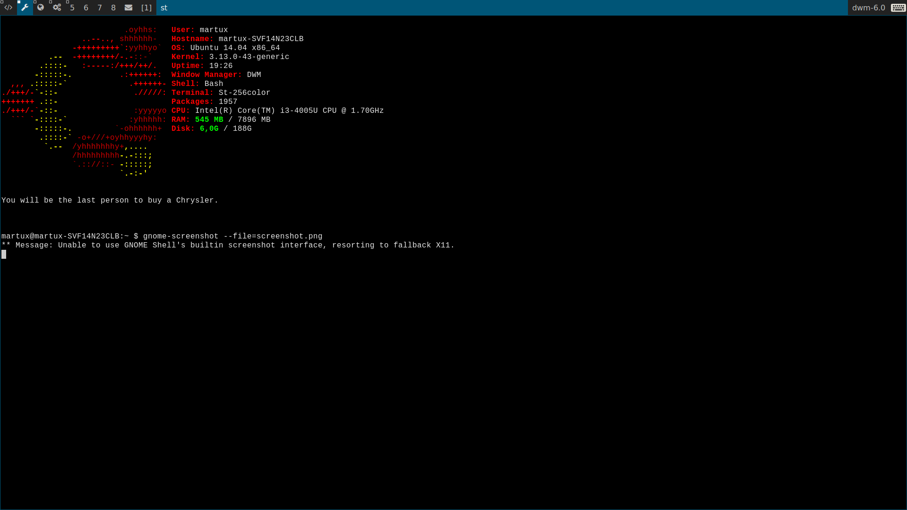

dwm - dynamic window manager
============================
[dwm](http://dwm.suckless.org/) is an extremely fast, small, and dynamic window manager for X.

Version
=======
[dwm 6.0](http://dl.suckless.org/dwm/dwm-6.0.tar.gz)

Patches
=======

(All patches can be found in their own branch)

1. [Pertag](http://dwm.suckless.org/patches/pertag) 
2. hidden-bar: shows top bar when urgent flag is set & unify top bar for all tags
3. mouseover-nofocus: Mouse over on client doesn't change focus
4. [Pango](http://dwm.suckless.org/patches/pango)
5. [Columns](http://dwm.suckless.org/patches/columns)
6. [Systray](http://dwm.suckless.org/patches/systray)

Keybindings
===========

    "[M]"  monocle                        : [Alt] +  m
    "[]="  tile                           : [Alt] +  t
    "><>"  no layout                      : [Alt] +  f
    "|||"  column                         : [Alt] +  c

    Invoke dmenu.sh (custom dmenu script) : [Alt]   + [p]
    Launch terminal                       : [Shift] + [Alt] + [Enter]
    Kill a window                         : [Shift] + [Alt] + [c]
    Quit                                  : [Shift] + [Alt] + [q]

Other settings
==============

- monocle is the default layout
- namster is 3
- terminal set as: urxvt (unicode-rxvt)

Screenshot
=========

Note
====

http://www.mail-archive.com/ratpoison-devel@nongnu.org/msg00561.html

AWT_TOOLKIT=MToolkit bin/jmeter
